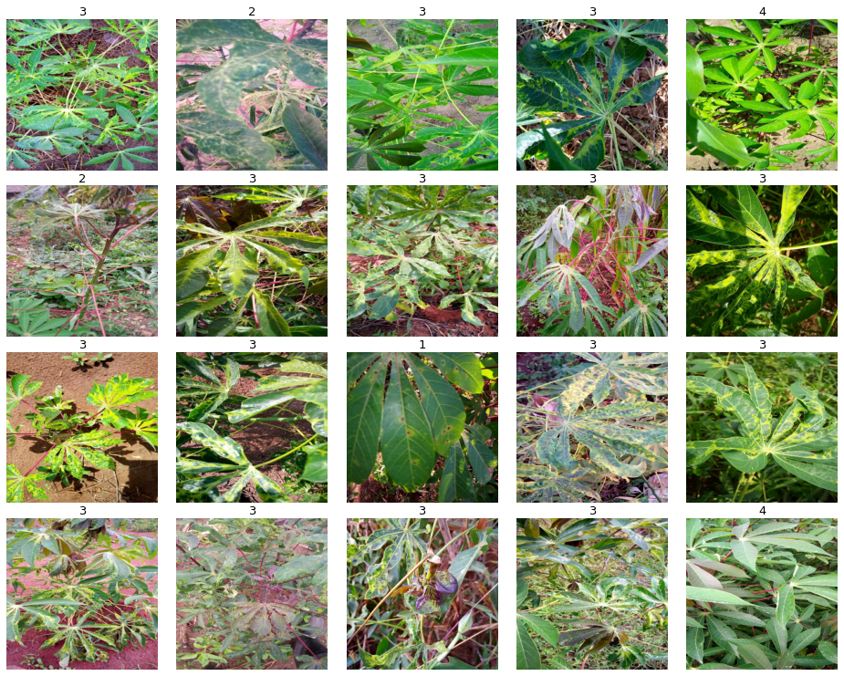

# Cassava-Leaf-Disease-Classification

# Action/Result
- Analyzed 21,000 low resolution images taken by cell phones and developed a classification model using Convolutional Neural Networks which successfully classifies an image of the casava leaf to the potential viral disease it may have.
- Achieved 90% accuracy.

# Visual Result

# Requirements
- Tensorflow

# Language Used
Python

# Method Used
- Convolutional Neural Network
